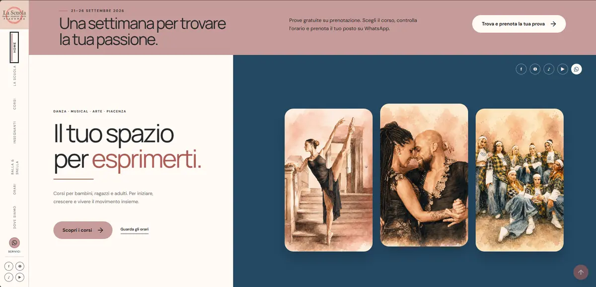
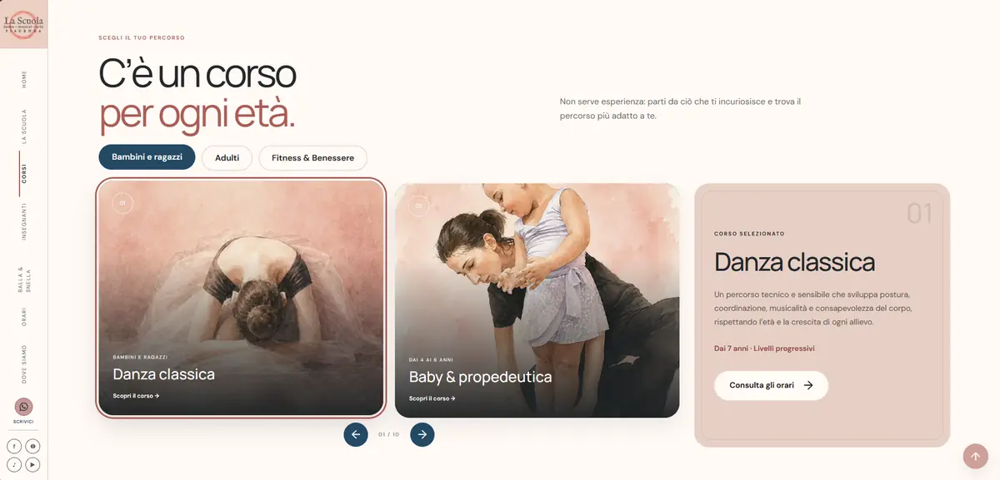
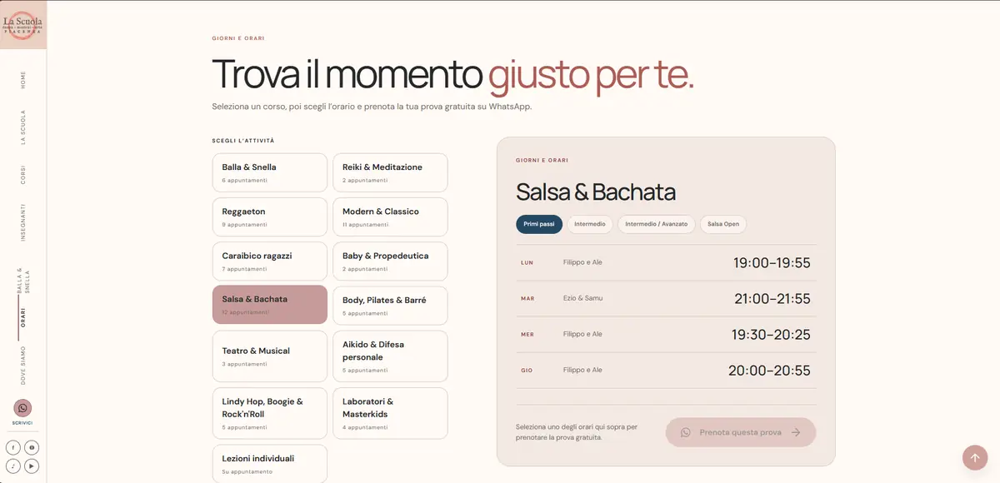
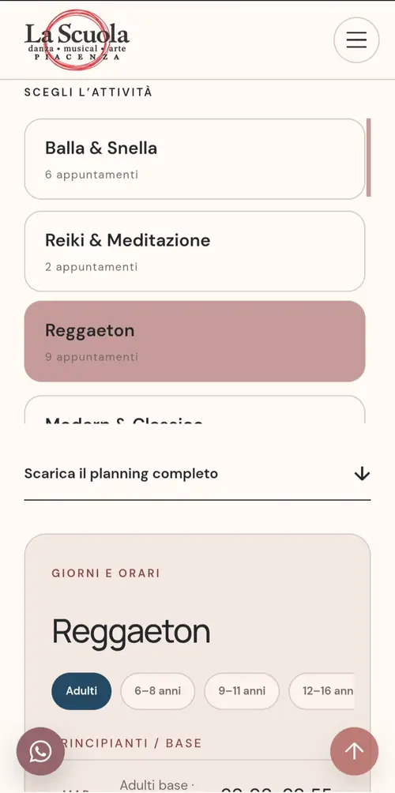

# La Scuola Piacenza — Production Website Case Study

A portfolio case study of a real production website developed for **La Scuola**, a dance, fitness and performing arts school based in Piacenza, Italy.

**Live website:** https://lascuolapiacenza.it/

> This public repository is a portfolio case study. The complete production repository remains private. Selected source files are included only to demonstrate implementation choices, code organisation and problem-solving.

## Project overview

The goal was to turn a large and varied course offering into a clear, modern and mobile-friendly website that could be used by real students and visitors.

The project covered the full path from interface implementation to production: responsive development, content organisation, interactive components, privacy handling, SEO setup, domain configuration and deployment.

## Screenshots

### Homepage — desktop

### Course catalogue — desktop

### Weekly schedule — desktop

### Mobile experience

  
  

## What I worked on

- responsive interface for desktop, tablet and mobile;
- desktop side navigation and mobile offcanvas navigation;
- interactive course catalogue with category filters;
- dynamic course detail rendering;
- touch/swipe course navigation on mobile;
- interactive weekly schedule with level and age filters;
- WhatsApp trial-booking flow with pre-filled messages;
- consent-based loading of Google Maps;
- privacy preference management and revocation;
- SEO metadata, Open Graph and Schema.org structured data;
- accessibility refinements and keyboard navigation;
- production deployment and domain configuration.

## Tech stack

- HTML5
- CSS3
- Bootstrap 5.3.3
- Vanilla JavaScript
- Git / GitHub

The production version intentionally does not require Node.js, npm, a JavaScript framework, PHP or a database.

## Key implementation challenges

### 1. Large course catalogue without confusing navigation

Courses were split into categories and rendered dynamically from structured data. The interface keeps only the relevant subset visible while maintaining a separate detail panel for the currently selected course.

### 2. Weekly planning with heterogeneous course structures

Different activities use different grouping rules: levels, age ranges, open classes and appointment-only lessons. The schedule logic normalises these differences into one reusable interface and connects each selectable slot to the booking flow.

### 3. Mobile adaptation beyond simple resizing

The desktop layout uses persistent side navigation and wide multi-column components. Mobile required a different navigation model, swipe interactions and schedule controls adapted to narrow screens rather than simply scaling the desktop UI down.

### 4. External content and privacy

Google Maps is not loaded automatically before consent. Consent is persisted locally with an expiry mechanism, can be changed later, and the map iframe is only assigned its source after approval.

## Selected code samples

The `code-samples/` directory contains selected JavaScript modules taken from the production project:

- `courses.js` — filtering, selection and dynamic rendering of course cards;
- `schedule.js` — schedule grouping, filtering and WhatsApp booking logic;
- `map-consent.js` — external-content consent management and deferred Google Maps loading.

These files are presented as implementation samples. The complete production source, content data and client assets are intentionally not published here.

## Production and portfolio separation

The real website is maintained in a separate private repository. This public repository exists specifically to document the project and demonstrate selected technical work without redistributing the complete production codebase or the client's full media library.

## Status

**Production:** live  
**Website:** https://lascuolapiacenza.it/
